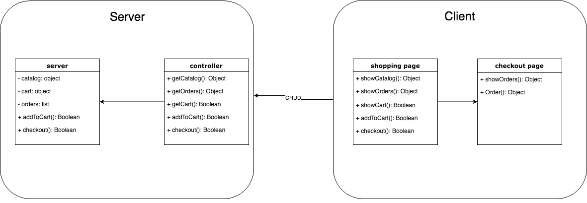

# Checkout Cart Example

## Product Requirements
1. Should show the list of items - `catalog`
1. Should show the list of `orders`
1. Should be able to add item to the cart and make checkout
1. If checkout process was successful, items show up in `orders` page

## Start
This project already contains empty files:
* `server.js` - file for server code
* `index.html`, `index.css`, `index.js` - static client files
* `npm install`
* `npm start`
* [http://localhost:3000](http://localhost:3000)

#solution:
###desing: 
 

### Server side:
#### server:
The logic layer of the server, holds the data as well.  
Data kept in server:
 
- catalog:  
All the items sold in the shop  
format: {item0: price0, ... itemN: priceN}

- cart:  
Items which were added to the cart and their quantity.  
format: {item0: quantity0, ... itemN: quantityN}

- orders:  
List of orders which were ordered.  
format: \[{item00: quantity00,..., item0N: quantity0N} .... {itemN0: quantityN0,...., itemN: quantityNN}\]

#### controller
API for server 

### Client side:
composed of 2 pages: 

#### Shopping page
A page for choosing items to add to cart.  
All the information found in page is retrieved from server, nothing is cached.

#### Checkout page
A page for adding cart to orders. 
As before, all the information found in page is retrieved from server, nothing is cached.
